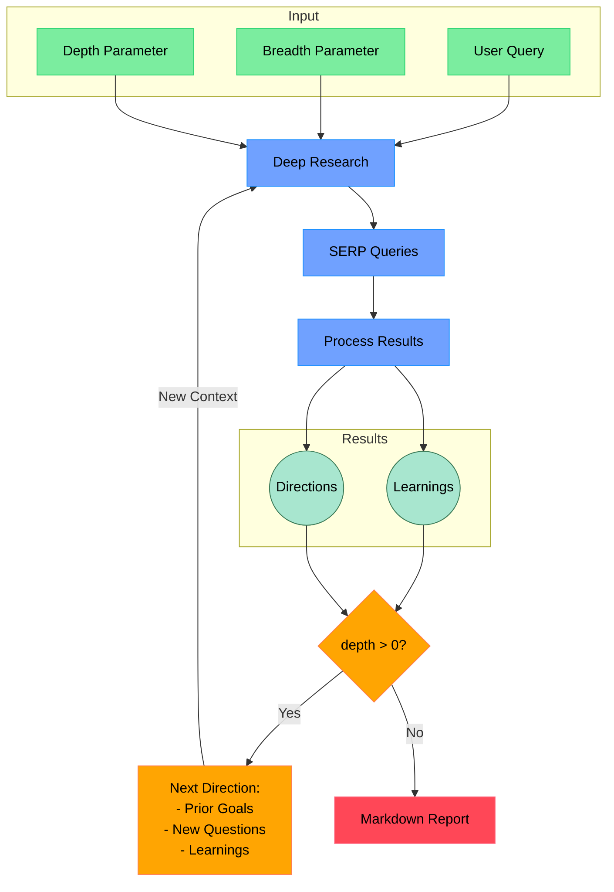

# Open Deep Research - Python

An AI-powered research assistant that performs iterative, deep research on any topic by combining search engines, web scraping, and large language models.

**🐍 This is the Python implementation of the [deep-research](https://github.com/dzhng/deep-research) project.**

The goal of this repo is to provide the simplest implementation of a deep research agent - e.g. an agent that can refine its research direction over time and deep dive into a topic. Goal is to keep the repo size at <500 LoC so it is easy to understand and build on top of.

**🐍 This repository contains the Python implementation. For the Node.js/TypeScript version, see the original repository.**

## How It Works



## Features

- **Iterative Research**: Performs deep research by iteratively generating search queries, processing results, and diving deeper based on findings
- **Intelligent Query Generation**: Uses LLMs to generate targeted search queries based on research goals and previous findings
- **Depth & Breadth Control**: Configurable parameters to control how wide (breadth) and deep (depth) the research goes
- **Smart Follow-up**: Generates follow-up questions to better understand research needs
- **Comprehensive Reports**: Produces detailed markdown reports with findings and sources
- **Concurrent Processing**: Handles multiple searches and result processing in parallel for efficiency
- **Multiple AI Providers**: Support for NVIDIA, OpenAI, Fireworks AI, and custom/local models
- **API Server**: Optional REST API for integration with other applications

## Requirements

- **Python 3.8+**
- API keys for:
  - **Firecrawl API** (for web search and content extraction)
  - One of the following AI providers:
    - **NVIDIA API** (recommended - access to Llama 3.1 70B, DeepSeek R1)
    - **Fireworks AI** (for DeepSeek R1)
    - **OpenAI API** (for GPT-4o-mini)
    - **Custom/Local** (for self-hosted models)

## Setup

### Python Installation

1. Clone the repository:
```bash
git clone https://github.com/Finance-LLMs/deep-research-python.git
cd deep-research-python
```

2. Install dependencies:
```bash
pip install -r requirements.txt
```

3. Set up environment variables in a `.env.local` file:

```bash

TAVILY_API_KEY="your_travily_key"

FIRECRAWL_KEY="your_firecrawl_key"
# If you want to use your self-hosted Firecrawl, add the following below:
# FIRECRAWL_BASE_URL="http://localhost:3002"

# NVIDIA API (build.nvidia.com) - Recommended
NVIDIA_API_KEY="your_nvidia_api_key"

# Alternative: OpenAI API (fallback)
OPENAI_KEY="your_openai_key"

# Alternative: Fireworks AI (for DeepSeek R1)
# FIREWORKS_KEY="your_fireworks_key"
```

### Docker Setup

1. Clone the repository
2. Rename `.env.example` to `.env.local` and set your API keys

3. Build the Docker image:
```bash
docker build -t deep-research-python .
```

4. Run the Docker container:
```bash
docker run -p 3051:3051 --env-file .env.local deep-research-python
```

Or use Docker Compose:
```bash
docker compose up -d
```

## Model Priority

The system automatically selects the best available model in this order:

1. **Custom Model** - if `CUSTOM_MODEL` and `OPENAI_ENDPOINT` are set
2. **NVIDIA Llama 3.1 70B** - if `NVIDIA_API_KEY` is set ⭐ **Recommended**
3. **DeepSeek R1** (Fireworks) - if `FIREWORKS_KEY` is set
4. **GPT-4o-mini** (OpenAI) - Fallback option

### NVIDIA API (Recommended)

NVIDIA's build.nvidia.com provides access to state-of-the-art models including:

- **Llama 3.1 70B**: Strong general-purpose model, excellent for research
- **DeepSeek R1**: Excellent reasoning capabilities, perfect for research tasks
- **Nemotron 70B**: NVIDIA's research-optimized model

To get an API key:
1. Visit [build.nvidia.com](https://build.nvidia.com)
2. Sign up for a free account
3. Generate an API key
4. Add it to your `.env.local` as `NVIDIA_API_KEY`

### Local/Custom Models

To use local LLM or custom OpenAI-compatible APIs, set these environment variables:

```bash
OPENAI_ENDPOINT="http://localhost:1234/v1"  # Your local server endpoint
CUSTOM_MODEL="your_model_name"              # Model name loaded in your server
OPENAI_KEY="your_api_key_if_needed"         # API key if required
```

These will take the highest priority if set.

### DeepSeek R1

Deep research performs excellently on R1! You can access DeepSeek R1 through:

#### NVIDIA (Recommended)
```bash
NVIDIA_API_KEY="your_nvidia_api_key"
```

#### Fireworks AI
```bash
FIREWORKS_KEY="your_fireworks_api_key"
```

## Usage

### Command Line Interface

Run the interactive research assistant:

```bash
python -m src.run
```

You'll be prompted to:

1. Enter your research query
2. Specify research breadth (recommended: 2-10, default: 4)
3. Specify research depth (recommended: 1-5, default: 2)
4. Choose between generating a report or a specific answer
5. Answer follow-up questions to refine the research direction

### API Server

Start the REST API server:

```bash
python -m src.api
```

The server will start on port 3051. Available endpoints:

#### POST `/api/research`
Perform research and get a concise answer.

#### POST `/api/generate-report`
Perform research and generate a detailed report.

Both endpoints accept:
```json
{
  "query": "Your research question",
  "breadth": 4,  // optional, default 4
  "depth": 2     // optional, default 2
}
```

Example request:
```bash
curl -X POST http://localhost:3051/api/research \
  -H "Content-Type: application/json" \
  -d '{"query": "Tesla stock performance 2025", "breadth": 3, "depth": 2}'
```

## Environment Variables

| Variable | Description | Default |
|----------|-------------|---------|
| `FIRECRAWL_KEY` | Your Firecrawl API key | Required |
| `FIRECRAWL_BASE_URL` | Custom Firecrawl endpoint | `https://api.firecrawl.dev` |
| `FIRECRAWL_CONCURRENCY` | Concurrency limit for scraping | `2` |
| `NVIDIA_API_KEY` | NVIDIA API key | Optional |
| `OPENAI_KEY` | OpenAI API key | Optional |
| `FIREWORKS_KEY` | Fireworks AI API key | Optional |
| `CUSTOM_MODEL` | Custom model name for local endpoints | Optional |
| `OPENAI_ENDPOINT` | Custom OpenAI-compatible endpoint | Optional |
| `CONTEXT_SIZE` | Maximum context size for prompts | `128000` |

## How the Research Process Works

1. **Initial Setup**
   - Takes user query and research parameters (breadth & depth)
   - Generates follow-up questions to understand research needs better

2. **Deep Research Process**
   - Generates multiple SERP queries based on research goals
   - Searches the web using Firecrawl API
   - Scrapes and processes search results to extract key learnings
   - Generates follow-up research directions

3. **Recursive Exploration**
   - If depth > 0, takes new research directions and continues exploration
   - Each iteration builds on previous learnings
   - Maintains context of research goals and findings

4. **Report Generation**
   - Compiles all findings into a comprehensive markdown report
   - Includes all sources and references
   - Organizes information in a clear, readable format

## Concurrency and Rate Limiting

### Firecrawl Rate Limits

- **Free tier**: Limited requests per minute
- **Paid tier**: Higher rate limits
- **Self-hosted**: No rate limits

Configure concurrency based on your Firecrawl plan:

```bash
# For free tier (to avoid rate limits)
FIRECRAWL_CONCURRENCY=1

# For paid tier or self-hosted
FIRECRAWL_CONCURRENCY=5
```

### Performance Tips

1. **Start with smaller parameters**: Use `breadth=2, depth=1` for testing
2. **Monitor rate limits**: Watch for 429 errors and adjust concurrency
3. **Use faster models**: NVIDIA models are generally faster than others
4. **Self-host Firecrawl**: For unlimited scraping without rate limits

## Troubleshooting

### Common Issues

1. **"No model found" error**: Ensure at least one AI provider API key is set
2. **Rate limit errors**: Reduce `FIRECRAWL_CONCURRENCY` or upgrade Firecrawl plan
3. **Empty search results**: Check Firecrawl API key and network connectivity
4. **Import errors**: Ensure all dependencies are installed with `pip install -r requirements.txt`

### Debug Mode

Add debug output by modifying the logging in `src/deep_research.py`:

```python
def log(*args):
    print(*args)  # Enable all debug output
```

## Contributing

Contributions are welcome! Please feel free to submit a Pull Request. Areas for improvement:

- Additional AI provider integrations
- Enhanced search result processing
- Better error handling and retry logic
- UI improvements for the CLI interface
- More comprehensive test coverage

## License

MIT License - feel free to use and modify as needed.
